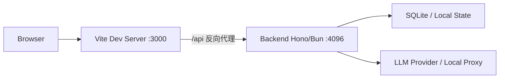
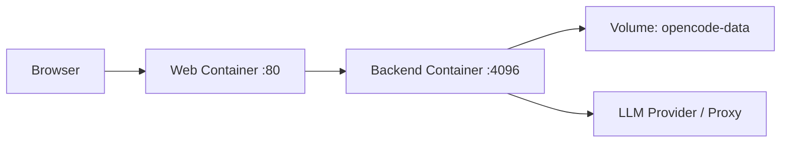
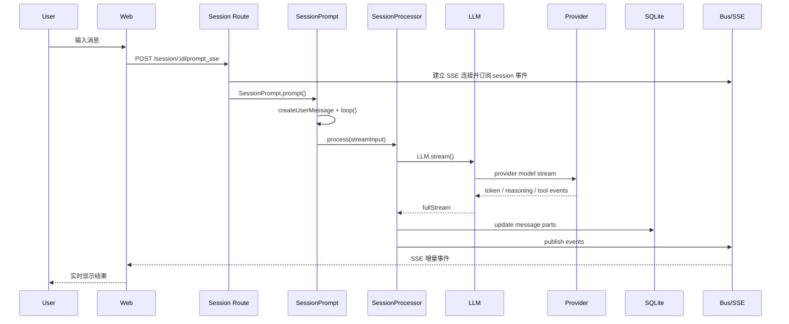

# OpenCode Powered Agent 系统架构分析

> 日期：2026-03-28
>
> 目标：沉淀当前项目的系统服务总览、后端架构与 `opencode core` 执行链，作为后续 debug、重构和演进的基线文档。

---

## 1. 系统服务总览

当前项目本质上是一个“Web UI + Agent Core Backend + LLM Provider/Proxy”的三段式系统，而不是一个简单的前后端问答应用。

从职责划分看：

- `web/` 负责会话 UI、消息输入、SSE 流消费、页面状态管理。
- `backend/` 负责 Session 编排、Agent 执行、Provider 抽象、Tool 调用、权限判定、消息持久化和事件分发。
- 外部或本地 LLM Provider 负责真正的模型推理，当前默认通过 `local-proxy` 走 OpenAI-compatible 接口。

核心代码入口：

- 后端启动入口：[backend/src/index.ts](/Users/terrence_tan/startups/opencode-powered-agent/backend/src/index.ts)
- HTTP 服务组装：[backend/src/server/server.ts](/Users/terrence_tan/startups/opencode-powered-agent/backend/src/server/server.ts)
- 前端代理配置：[web/vite.config.ts](/Users/terrence_tan/startups/opencode-powered-agent/web/vite.config.ts)
- 项目启动脚本：[package.json](/Users/terrence_tan/startups/opencode-powered-agent/package.json)

### 1.1 部署架构

开发态部署架构：

生产态部署架构：

依据：

- 开发启动脚本使用 `concurrently` 同时启动前后端，[package.json](/Users/terrence_tan/startups/opencode-powered-agent/package.json)
- 前端开发服务器运行在 `3000`，并将 `/api` 代理到 `4096`，[web/vite.config.ts](/Users/terrence_tan/startups/opencode-powered-agent/web/vite.config.ts)
- 生产容器暴露 `web:80`、`backend:4096`，并挂载 `opencode-data` 数据卷，[docker-compose.yml](/Users/terrence_tan/startups/opencode-powered-agent/docker-compose.yml)

### 1.2 进程架构

当前系统在运行时至少包含以下进程或服务单元：

1. Web 前端进程
   - 开发态是 Vite dev server
   - 生产态是静态资源容器或 nginx 类服务

2. Backend Agent Core 进程
   - Bun 运行时承载 Hono HTTP 服务
   - 内部同时承载 Session、Tool、Provider、Bus、SQLite 访问

3. 外部模型服务进程
   - 可能是本地代理服务
   - 也可能是远端 Anthropic/OpenAI/Google 等服务

4. 可选辅助服务
   - MCP 服务
   - Shell / Git / 文件系统工具调用的宿主环境

关键点：

- 后端不是“纯 HTTP API server”，它本质上是一个带状态的 Agent Runtime。
- 一次聊天请求会跨越 HTTP、Session 编排、模型流、工具调用、数据库写入和 SSE 推送多个层次。
- 这决定了该系统的排障不能只盯接口返回码，必须同时观察事件流和持久化状态。

## 2. 后端代码分层

后端代码可以按职责划为 7 层。

### 2.1 接入层

负责 HTTP 接口、OpenAPI、SSE 和中间件。

- 服务组装：[backend/src/server/server.ts](/Users/terrence_tan/startups/opencode-powered-agent/backend/src/server/server.ts)
- Session 路由：[backend/src/server/routes/session.ts](/Users/terrence_tan/startups/opencode-powered-agent/backend/src/server/routes/session.ts)
- Global 路由：[backend/src/server/routes/global.ts](/Users/terrence_tan/startups/opencode-powered-agent/backend/src/server/routes/global.ts)
- Provider 路由：[backend/src/server/routes/provider.ts](/Users/terrence_tan/startups/opencode-powered-agent/backend/src/server/routes/provider.ts)

这一层的职责是：

- 做请求校验
- 解析 `directory`
- 建立 SSE 连接
- 调用下游编排逻辑
- 把内部异常转成 API 错误

### 2.2 实例隔离层

这是当前系统最关键的结构之一。

- 目录实例管理：[backend/src/project/instance.ts](/Users/terrence_tan/startups/opencode-powered-agent/backend/src/project/instance.ts)
- 启动初始化：[backend/src/project/bootstrap.ts](/Users/terrence_tan/startups/opencode-powered-agent/backend/src/project/bootstrap.ts)
- 项目识别：[backend/src/project/project.ts](/Users/terrence_tan/startups/opencode-powered-agent/backend/src/project/project.ts)

该层的核心机制：

- 每个请求会根据 `directory` 进入一个独立的 `Instance`
- `Instance` 上下文至少包含 `directory`、`worktree`、`project`
- 绝大多数状态不是全局单例，而是按目录隔离缓存

这非常符合 opencode 的运行时气质：同一套 Agent Core 可以服务多个项目目录，但每个目录拥有独立上下文。

### 2.3 会话编排层

这是“对话请求如何变成 Agent 执行”的核心。

- Session 主模型：[backend/src/session/index.ts](/Users/terrence_tan/startups/opencode-powered-agent/backend/src/session/index.ts)
- Prompt 编排：[backend/src/session/prompt.ts](/Users/terrence_tan/startups/opencode-powered-agent/backend/src/session/prompt.ts)
- Processor 状态机：[backend/src/session/processor.ts](/Users/terrence_tan/startups/opencode-powered-agent/backend/src/session/processor.ts)
- LLM 出口：[backend/src/session/llm.ts](/Users/terrence_tan/startups/opencode-powered-agent/backend/src/session/llm.ts)
- 消息结构：[backend/src/session/message-v2.ts](/Users/terrence_tan/startups/opencode-powered-agent/backend/src/session/message-v2.ts)

这一层负责：

- 创建用户消息
- 构建本轮会话上下文
- 选择 agent/model/tools/permissions
- 调用 LLM 流接口
- 将流式事件拆解为 message parts
- 触发工具执行与错误处理

### 2.4 能力扩展层

- Agent 定义：[backend/src/agent/agent.ts](/Users/terrence_tan/startups/opencode-powered-agent/backend/src/agent/agent.ts)
- Tool 注册表：[backend/src/tool/registry.ts](/Users/terrence_tan/startups/opencode-powered-agent/backend/src/tool/registry.ts)
- 权限系统：[backend/src/permission/next.ts](/Users/terrence_tan/startups/opencode-powered-agent/backend/src/permission/next.ts)
- Plugin 扩展点：[backend/src/plugin/index.ts](/Users/terrence_tan/startups/opencode-powered-agent/backend/src/plugin/index.ts)
- MCP 集成：[backend/src/mcp/index.ts](/Users/terrence_tan/startups/opencode-powered-agent/backend/src/mcp/index.ts)

这一层决定了系统是否只是“聊天”，还是“能执行任务的 Agent”。

### 2.5 Provider 抽象层

- Provider 注册与加载：[backend/src/provider/provider.ts](/Users/terrence_tan/startups/opencode-powered-agent/backend/src/provider/provider.ts)
- Provider 配置：[opencode.json](/Users/terrence_tan/startups/opencode-powered-agent/opencode.json)

这一层负责：

- 解析 provider 和 model
- 注入 baseURL、apiKey、headers、providerOptions
- 适配 OpenAI-compatible / Anthropic / Google 等不同 SDK
- 处理 SSE 超时包装和 provider-specific 行为

### 2.6 持久化层

- DB 封装：[backend/src/storage/db.ts](/Users/terrence_tan/startups/opencode-powered-agent/backend/src/storage/db.ts)
- DB schema：[backend/src/storage/schema.ts](/Users/terrence_tan/startups/opencode-powered-agent/backend/src/storage/schema.ts)
- Session SQL：[backend/src/session/session.sql.ts](/Users/terrence_tan/startups/opencode-powered-agent/backend/src/session/session.sql.ts)

当前架构不是严格的 event sourcing，而是：

- 以 SQLite 为真实状态源
- 每次 message / part 更新后再通过 Bus 派发事件

### 2.7 事件分发层

- 实例级事件总线：[backend/src/bus/index.ts](/Users/terrence_tan/startups/opencode-powered-agent/backend/src/bus/index.ts)
- 全局总线与 SSE 路由：[backend/src/server/routes/global.ts](/Users/terrence_tan/startups/opencode-powered-agent/backend/src/server/routes/global.ts)

关键点：

- `Bus.publish()` 先通知本实例订阅者，再镜像到 `GlobalBus`
- 这意味着事件既有“实例内语义”，也有“全局广播语义”
- 如果前端没有搞清楚消费的是哪种流，极易出现事件丢失、重复或归属判断错误

## 3. 后端技术分层

如果从技术栈视角而不是代码目录视角看，后端可以拆成以下技术层次。

### 3.1 Runtime 与 Web 层

- Runtime：Bun
- HTTP：Hono
- OpenAPI：`hono-openapi`
- SSE：Hono streaming / `streamSSE`

### 3.2 AI 编排层

- AI SDK：`ai`
- 多 provider 适配：`@ai-sdk/*`
- Prompt 变换：`SystemPrompt`、`InstructionPrompt`、`ProviderTransform`

### 3.3 Agent 能力层

- Agent 模式与 prompt 覆盖
- Tool 系统
- Permission 规则引擎
- Plugin 钩子系统
- MCP 生态集成

### 3.4 State 与 Persistence 层

- SQLite
- Drizzle ORM 风格封装
- Session / Message / Part 持久化
- Snapshot / Diff / Revert 支持

### 3.5 Integration 层

- Git / Shell / 文件系统
- 本地目录 / worktree 边界判断
- 外部模型服务或本地 proxy

这一技术分层说明一件事：当前后端不是传统 CRUD 服务，而是“推理编排型后端”。因此其复杂度不在 HTTP，而在运行时协同。

## 4. opencode core 执行链

这一部分是整个系统最重要的内容。

### 4.1 主执行链

当用户在前端输入“你好”并发送时，理想执行链如下：

### 4.2 路由层入口

当前直接流式聊天入口位于：

- [`backend/src/server/routes/session.ts#L846`](/Users/terrence_tan/startups/opencode-powered-agent/backend/src/server/routes/session.ts#L846)

`prompt_sse` 的职责：

- 建立 SSE 响应
- 先发送 `stream.connected`
- 订阅与当前 `sessionID` 相关的 Bus 事件
- 调用 `SessionPrompt.prompt()`
- 在完成时发送 `stream.done`
- 在异常时发送 `stream.error`

这是当前前端对话流式渲染的直接依赖点。

### 4.3 SessionPrompt：编排中枢

[`backend/src/session/prompt.ts`](/Users/terrence_tan/startups/opencode-powered-agent/backend/src/session/prompt.ts) 是整个 `opencode core` 的大脑。

它至少承担了以下职责：

- 创建 user message
- 合并 session permission 与兼容 `tools` 参数
- 进入 `loop()`
- 在 loop 内解析 agent、model、system prompt、messages、tools
- 处理 compaction、subtask、summary 等高级分支

这层决定“这次请求应该让哪个 agent 用哪个模型、以什么能力集合去执行”。

### 4.4 SessionProcessor：流式状态机

[`backend/src/session/processor.ts`](/Users/terrence_tan/startups/opencode-powered-agent/backend/src/session/processor.ts) 是第二个关键点。

它不是简单拿文本返回前端，而是把 LLM 的事件流翻译成系统内部的状态变更：

- `start`
- `reasoning-start` / `reasoning-delta` / `reasoning-end`
- `tool-input-start`
- `tool-call`
- `tool-result`
- `tool-error`
- `start-step`
- `error`

每一种事件都可能写入不同类型的 `Part`，并触发不同的系统副作用。

这意味着：

- 前端最终看到的“消息增量”，本质上是 Processor 驱动出来的结构化状态
- 如果 Processor 的事件处理有偏差，前端会表现为“没返回内容”、“工具状态卡住”、“文本中断”

### 4.5 LLM：统一流出口

[`backend/src/session/llm.ts`](/Users/terrence_tan/startups/opencode-powered-agent/backend/src/session/llm.ts) 的作用是把编排结果转成 AI SDK 能消费的流请求。

其关键职责包括：

- 拼 system prompt
- 合并 provider/model/agent options
- 注入 plugin 变换
- 解析 active tools
- 构造 headers
- 调用 `streamText`

这是“编排层”和“provider 层”的分界线。

### 4.6 Provider：外部模型边界

[`backend/src/provider/provider.ts`](/Users/terrence_tan/startups/opencode-powered-agent/backend/src/provider/provider.ts) 负责真正接模型。

这里处理了大量差异化适配：

- bundled providers
- OpenAI-compatible
- 本地 proxy
- Copilot / OpenRouter / Anthropic 等特例
- SSE 读超时包装
- model loader 选择

因此，很多运行时问题虽然表现在聊天页，但根因其实在 provider 层：

- API Key 缺失
- baseURL 配错
- model ID 不匹配
- proxy 返回的 SSE 格式不稳定

## 5. 演进建议

当前系统已经能跑起来，但从可维护性和可演进性看，建议优先推进以下方向。

### 5.1 固化聊天流协议

建议将“对话页消费的事件格式”抽成明确的 Chat Stream Contract，而不是直接让前端依赖底层 `message.part.delta` 等内部事件。

原因：

- 当前内部 Bus 事件是后端状态变更语义
- 前端真正需要的是 UI 渲染语义
- 两者直接耦合会导致后端重构困难

### 5.2 拆分编排与持久化副作用

当前 `SessionProcessor` 同时做：

- 模型流消费
- Part 生成
- 持久化
- 事件发布

建议逐步拆为：

- 流解释层
- 状态持久化层
- 事件投递层

这样可以降低调试复杂度，也更利于补集成测试。

### 5.3 增强 provider 可观测性

应补齐以下可观测信息：

- 本轮实际选择的 providerID / modelID
- 实际 baseURL
- 鉴权来源
- provider 返回首包耗时
- 首个 delta 到达耗时
- timeout / retry / 401 等失败分类

这会显著降低“后端看起来没问题，但前端一直没流”的定位成本。

### 5.4 给 Instance 隔离补完整诊断标签

建议所有关键日志都带：

- `directory`
- `worktree`
- `projectID`
- `sessionID`
- `messageID`

当前系统按目录隔离实例，这是架构优势，但如果日志缺少这些上下文，排障会非常痛苦。

### 5.5 收敛 tool / permission / plugin 的最终视图

建议为每轮 loop 输出最终快照：

- 可用工具列表
- 被禁用工具列表及原因
- 最终 permission rules
- plugin 改写后的 prompt/header/options

否则一旦模型表现异常，很难判断是 provider 问题还是能力集被剪掉了。

### 5.6 建立后端端到端回归测试

最少应覆盖以下用例：

1. `prompt_sse` 正常产生文本流
2. provider 401 时能正确产出 `session.error` 和 `stream.error`
3. tool call -> tool result 能正确写库并回推前端
4. 多 `directory` 实例并行时事件不串线

## 6. 当前风险

当前风险不是某一个 bug，而是几个结构性风险叠加。

### 6.1 聊天链路跨层过多

一次消息发送横跨：

- 前端请求
- SSE
- Session 编排
- LLM provider
- Tool/Permission
- SQLite
- Bus

这导致任一层的小问题都可能表现为“前端没有结果”。

### 6.2 目录实例隔离容易产生隐式错误

系统按 `directory` 建立独立实例是正确方向，但风险在于：

- 请求与事件可能不在同一个实例上下文
- 调试时容易误以为状态没更新，实际是更新在另一个目录实例

### 6.3 Provider 层是当前最脆弱的外部边界

根据已有联调现象，至少已经暴露过一次 `401 Invalid or missing API Key`。这说明：

- 会话编排链可能是通的
- 但 provider readiness 还不稳定

所以任何“前端没流出结果”的问题，都必须把 provider 鉴权和模型选择放在高优先级排查。

### 6.4 内部事件模型与前端渲染模型耦合较深

如果前端直接消费后端内部 Part 级事件：

- 后端改动 message/part 结构会直接冲击前端
- 前端需要理解过多内部实现细节

这是当前系统演进时最大的维护成本来源之一。

### 6.5 Provider/Auth 仍有迁移痕迹

在 [`backend/src/provider/provider.ts`](/Users/terrence_tan/startups/opencode-powered-agent/backend/src/provider/provider.ts) 中仍可见 Auth stub，这说明认证与 provider 管理体系还没有完全收口。

这类迁移中状态如果不尽快清理，后续会持续带来：

- 运行路径不透明
- 配置来源不唯一
- 联调时行为不稳定

### 6.6 缺少以执行链为中心的文档与测试

此前问题暴露后，修复过程反复说明：

- 现有文档更多是接口与模块说明
- 但缺少“从发送消息到 SSE 返回”的链路级文档
- 也缺少对整条链路的自动化守护

这会导致每次修复都要重新理解系统。

## 7. 结论

当前项目的后端架构，核心不是普通 REST API，而是一个按项目目录隔离的 Agent Runtime。

它的结构优势在于：

- 能承载多项目上下文
- 能支持 Agent、Tool、Permission、Plugin 等复杂能力
- 能以流式方式把内部执行状态反馈到前端

它的主要复杂度也来自这里：

- `Instance` 让状态不再全局唯一
- `SessionPrompt` 让请求进入复杂编排
- `SessionProcessor` 把模型事件翻译为系统状态
- `Provider` 把外部模型差异带入系统内部

因此，后续真正要稳住系统，不是继续堆接口，而是围绕以下主线持续建设：

1. 固化对话流协议
2. 增强 provider 与编排可观测性
3. 拆分副作用耦合
4. 补齐端到端回归测试
5. 收敛多实例运行时的诊断能力

---

## 附：关键代码索引

- 后端入口：[backend/src/index.ts](/Users/terrence_tan/startups/opencode-powered-agent/backend/src/index.ts)
- HTTP 组装：[backend/src/server/server.ts](/Users/terrence_tan/startups/opencode-powered-agent/backend/src/server/server.ts)
- Session SSE 路由：[backend/src/server/routes/session.ts](/Users/terrence_tan/startups/opencode-powered-agent/backend/src/server/routes/session.ts)
- 实例隔离：[backend/src/project/instance.ts](/Users/terrence_tan/startups/opencode-powered-agent/backend/src/project/instance.ts)
- Session 编排：[backend/src/session/prompt.ts](/Users/terrence_tan/startups/opencode-powered-agent/backend/src/session/prompt.ts)
- Processor 状态机：[backend/src/session/processor.ts](/Users/terrence_tan/startups/opencode-powered-agent/backend/src/session/processor.ts)
- LLM 出口：[backend/src/session/llm.ts](/Users/terrence_tan/startups/opencode-powered-agent/backend/src/session/llm.ts)
- Provider 抽象：[backend/src/provider/provider.ts](/Users/terrence_tan/startups/opencode-powered-agent/backend/src/provider/provider.ts)
- Message/Part 模型：[backend/src/session/message-v2.ts](/Users/terrence_tan/startups/opencode-powered-agent/backend/src/session/message-v2.ts)
- 事件总线：[backend/src/bus/index.ts](/Users/terrence_tan/startups/opencode-powered-agent/backend/src/bus/index.ts)
- API 文档：[docs/backend-api/opencode-agent-core-api.md](/Users/terrence_tan/startups/opencode-powered-agent/docs/backend-api/opencode-agent-core-api.md)
